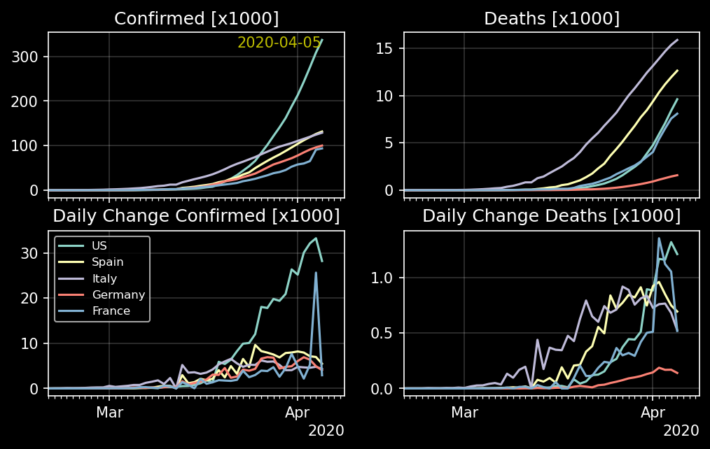
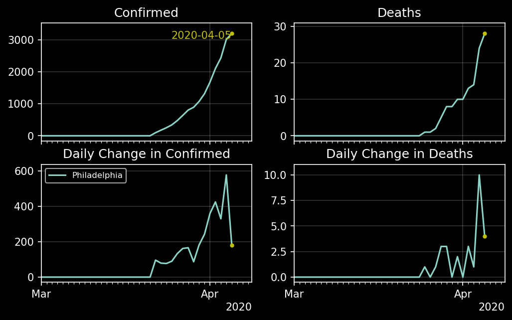

# covid
Data Analysis of COVID-19 Dataset

# Conda Enviornment Setup

1. Install [Anaconda](https://www.anaconda.com/)
2. Create conda environment
    ```
   conda env create -f covid.yml
   ```
3. Activate the new conda environment
    ```
   conda activate covid
   ```

# Basic Usage
Activate the conda environment before running any of the python scripts

# Time Series for Countries

```
python countries.py
```



---

# Time Series for State / Provinces

```
python states.py
```


# Time Series for Philadelphia

```
python philadelphia.py
```

